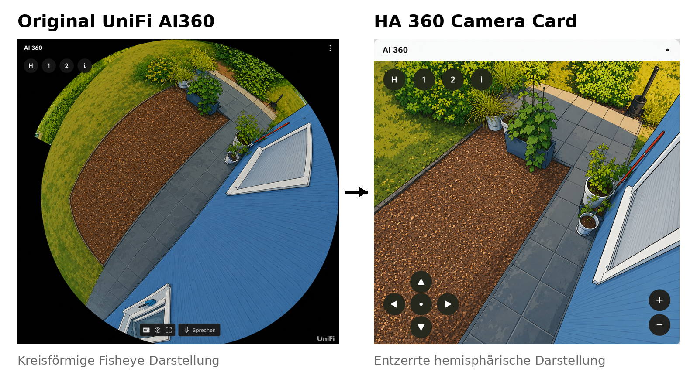
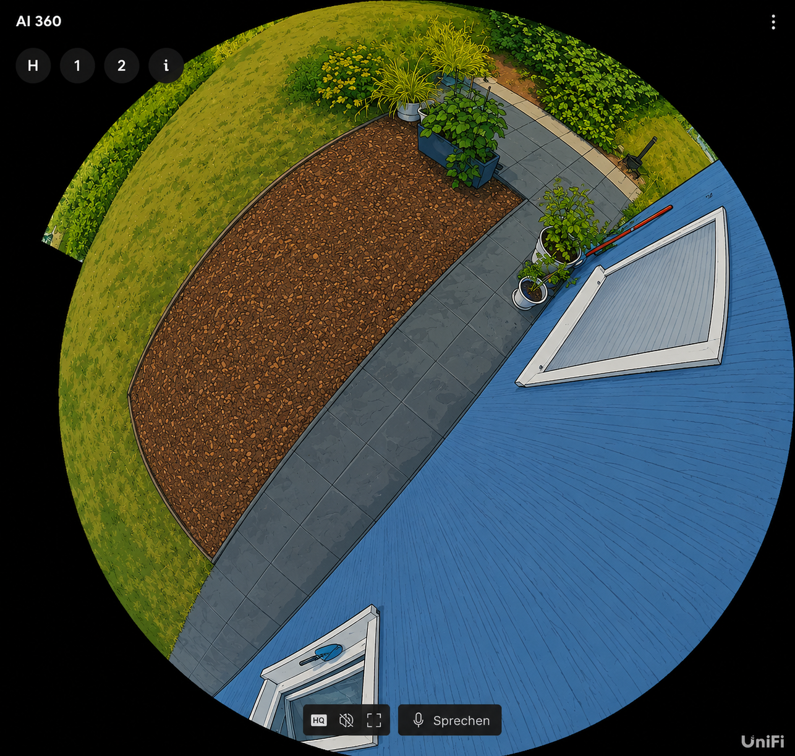
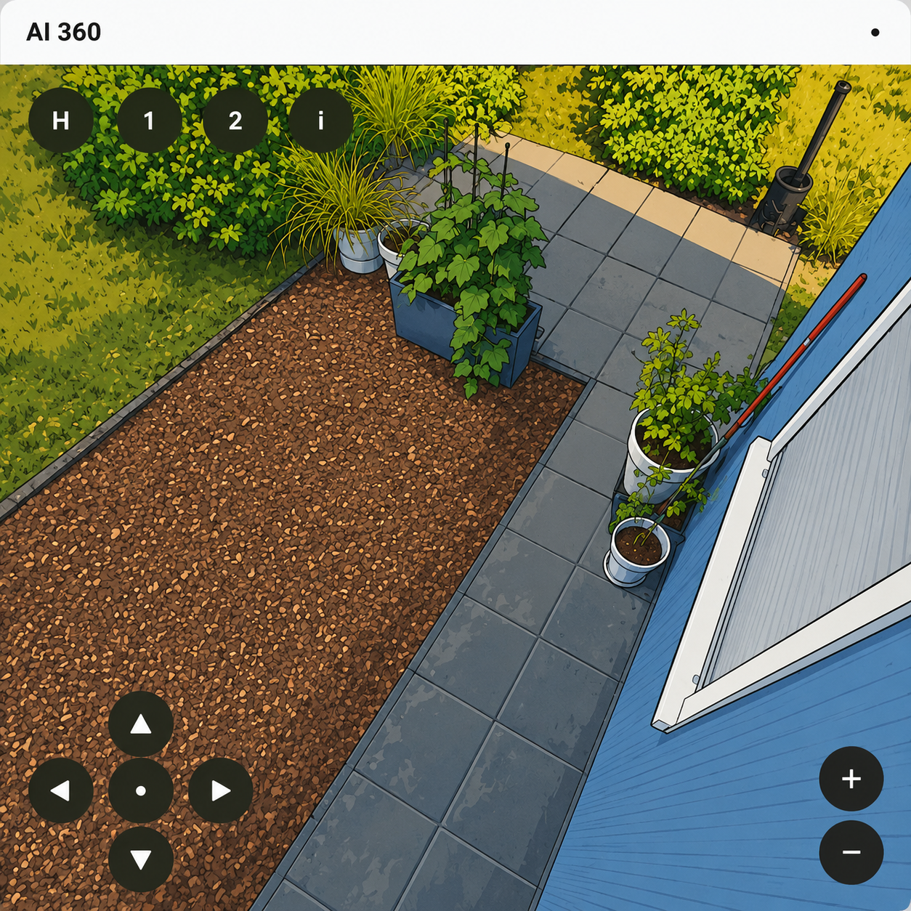

# HA 360 Camera Card



A modern **WebGL viewer** for **UniFi AI360** and **UniFi G6 Pro 360**
cameras with **WebRTC (WHEP/go2rtc)** support and seamless **Home
Assistant** integration.

## ✨ Features

-   GPU accelerated WebGL rendering
-   WebRTC / WHEP (go2rtc)
-   UniFi AI360 & G6 Pro 360 support
-   Mouse, touch and keyboard navigation
-   Home position
-   Camera presets
-   HACS compatible
-   Lovelace dashboard card


## Camera mounting

Version 1.2.0 adds installation-aware controls. In the visual card editor, choose whether the camera is mounted on a ceiling, wall, sloped roof or in a custom orientation. Mouse, touch, keyboard and direction-button movement are transformed automatically while camera calibration remains unchanged.

```yaml
mounting_mode: roof
mounting_rotation: 180
mounting_tilt: 35
```

Available values for `mounting_mode`: `ceiling`, `up`, `wall`, `roof`, `custom`.

------------------------------------------------------------------------

# Original UniFi vs. HA 360 Camera Card

## Original UniFi AI360



The standard UniFi interface displays the camera as a circular fisheye
image. Large parts of the available screen remain unused and objects
near the edges appear strongly distorted.

------------------------------------------------------------------------

## HA 360 Camera Card



The HA 360 Camera Card transforms the fisheye image into a much more
usable hemispherical view with a larger visible area, reduced edge
distortion and a more natural perspective.

### Advantages

-   Larger usable image area
-   Reduced edge distortion
-   Optimized for Home Assistant dashboards
-   Interactive navigation
-   Preset support
-   WebRTC streaming


## Static event images (v1.2.2)

The same WebGL dewarping and controls can be used with Home Assistant JPG snapshots:

```yaml
type: custom:ha-360-camera-card
title: Last motion
source_type: image
image_url: /local/snapshots/last_motion.jpg
image_refresh_interval: 10
camera_profile: unifi_ai360
projection: hemisphere
mounting_mode: wall
```

A folder button in the card can also open a local JPG, PNG or WebP temporarily.


## G6 Pro 360 – Wandkalibrierung (Ausrichtung 0°)

Gemessene Standardwerte:

```yaml
camera_profile: unifi_g6_pro_360
mounting_mode: wall
mounting_rotation: 0
yaw: -90
pitch: 89.75
roll: 180
fov: 25
yaw_min: -169
yaw_max: -11
pitch_min: 12
pitch_max: 167.5
```

Im visuellen Editor können diese Werte über „G6 Pro 360 Wandkalibrierung übernehmen“ gesetzt werden. Statische Bilder können über den Home-Assistant-Medienbrowser oder einen manuellen Pfad gewählt werden.

## Mounting help / Hilfe zur Montage

See [Camera mounting and control axes](docs/mounting.md) for the illustrated Down, Up, Wall and disabled Sloped modes.

Die bebilderte Hilfe zu Standard-, Aufwärts- und Wandmontage sowie der deaktivierten Schräge findest du unter [Kameramontage und Steuerachsen](docs/mounting.md).


## v1.2.2 correction: wall rotation and generic profiles

- In wall mounting mode, left/right controls rotate around the optical camera axis again instead of panning.
- Selecting `generic` or `generic_circular_fisheye` in the visual editor shows the complete calibration/YAML values directly below the profile selector.
