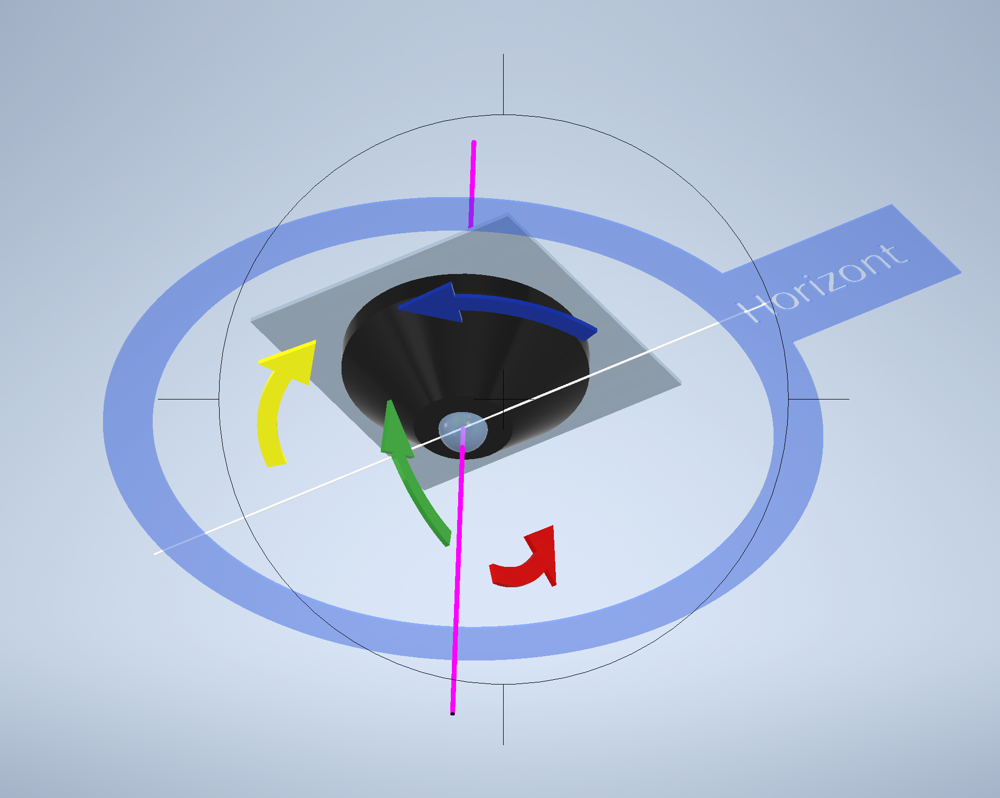
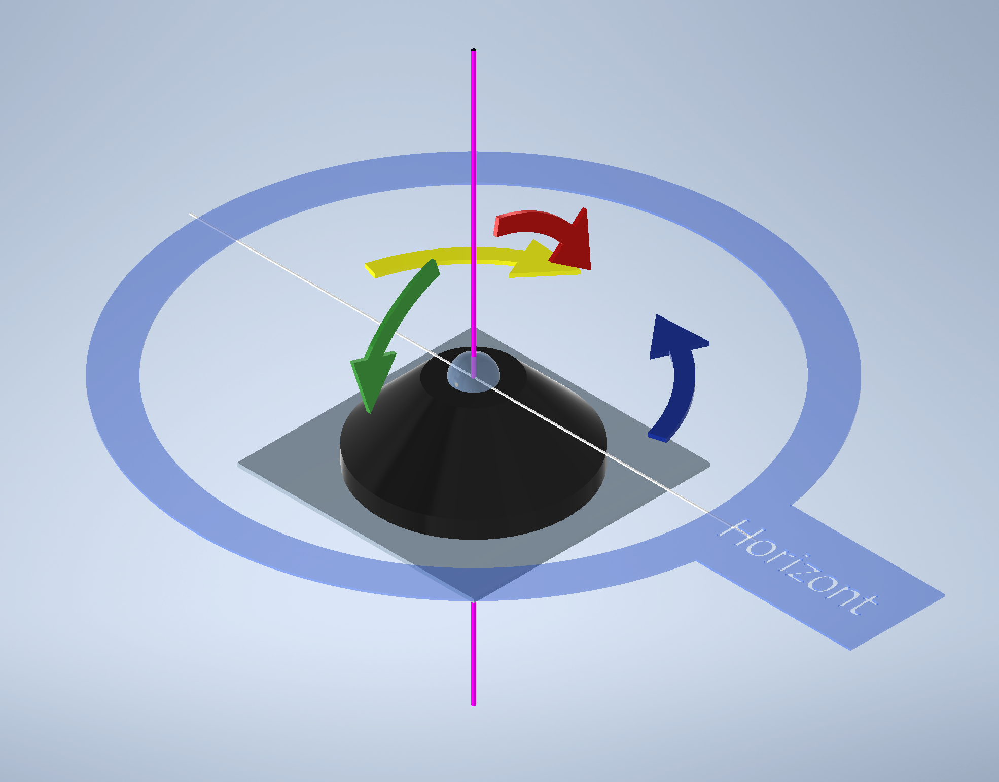
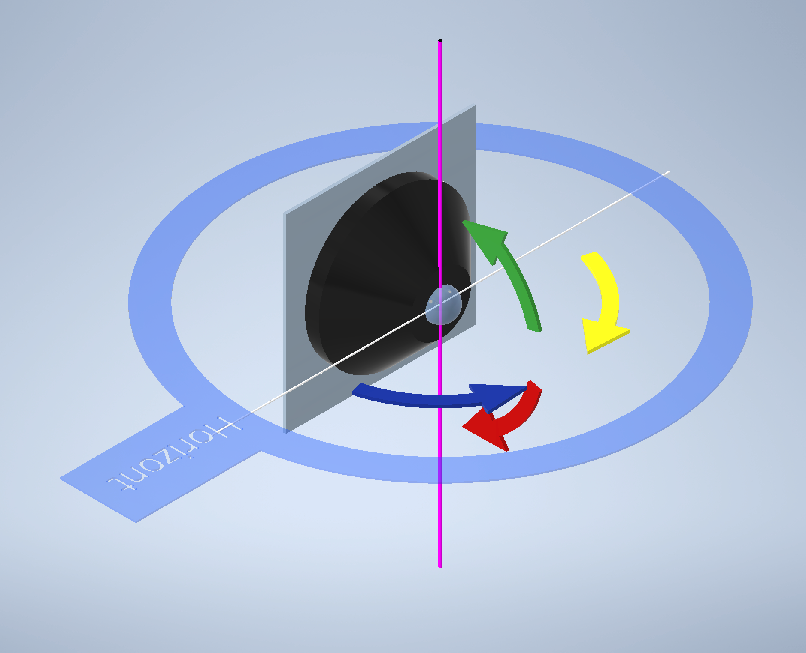
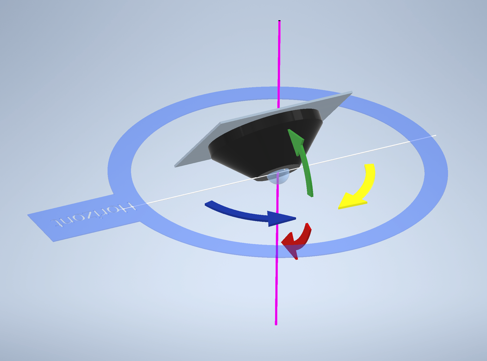

# Camera mounting and control axes / Kameramontage und Steuerachsen

The mounting mode changes the relationship between the physical optical axis
and the controls. Blue/yellow describe horizontal movement around the purple
axis. Red/green describe up/down movement around the white axis.

Die Montagelage verändert die Beziehung zwischen optischer Kameraachse und
Bedienung. Blau/Gelb beschreibt die horizontale Bewegung um die lila Achse.
Rot/Grün beschreibt das Schwenken nach oben und unten um die weiße Achse.

## Standard: camera looking down / Standard: Kamera nach unten



```yaml
mounting_mode: ceiling
mounting_rotation: 0
```

This is the established default and remains unchanged.

Dies ist die bewährte Standardmontage und bleibt unverändert.

## Camera looking up / Kamera nach oben



Example calibration confirmed for a G6 Pro 360:

```yaml
mounting_mode: up
mounting_rotation: 0
yaw: 255.35684595352583
pitch: 119.86950787927326
roll: -180
fov: 60
pitch_min: 102
pitch_max: 258
yaw_min: 0
yaw_max: 360
control_invert_x: true
control_invert_y: true
```

## Wall / Wand



For wall mounting, horizontal mouse/touch movement is corrected separately so
that dragging right also moves the view right. Button and keyboard inversion
remain controlled by `control_invert_x` and `control_invert_y`.

Bei Wandmontage wird die horizontale Maus-/Touchbewegung separat korrigiert,
damit Ziehen nach rechts auch die Ansicht nach rechts bewegt. Die Richtung von
Buttons und Tastatur wird weiterhin über `control_invert_x` und
`control_invert_y` festgelegt.

Confirmed G6 Pro 360 example:

```yaml
mounting_mode: wall
mounting_rotation: 0
yaw: -84
pitch: 270
roll: -180
fov: 40
pitch_min: 195
pitch_max: 348
yaw_min: -169
yaw_max: -11
control_invert_x: false
control_invert_y: true
```

## Sloped roof — disabled / Schräge Montage — deaktiviert



The automatic sloped mounting mode is currently disabled because the axis
mapping has not yet been reliably calibrated. Use `mounting_mode: custom` and
the expert geometry fields when testing a sloped installation.

Die automatische schräge Montage ist derzeit deaktiviert, weil die
Achsenabbildung noch nicht zuverlässig kalibriert ist. Für Tests unter einem
Dachüberstand bitte `mounting_mode: custom` und die Expertenfelder verwenden.

## Expert geometry / Experten-Geometrie

The visual editor contains a **Geometry & Expert** tab with:

- `fisheye_fov`
- `circle_radius`
- `center_x`, `center_y`
- `yaw_min`, `yaw_max`
- `pitch_min`, `pitch_max`
- `invert_x`, `invert_y`
- `control_invert_x`, `control_invert_y`
- `mirror`, `rotate`, `projection`

Der visuelle Editor bündelt diese Einstellungen im Tab
**Geometrie & Experten**.
